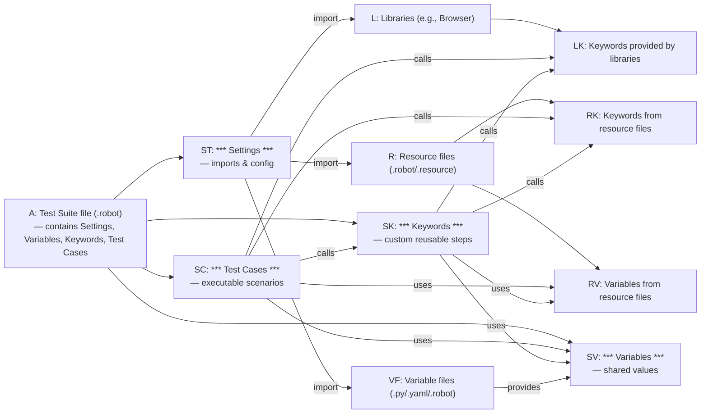
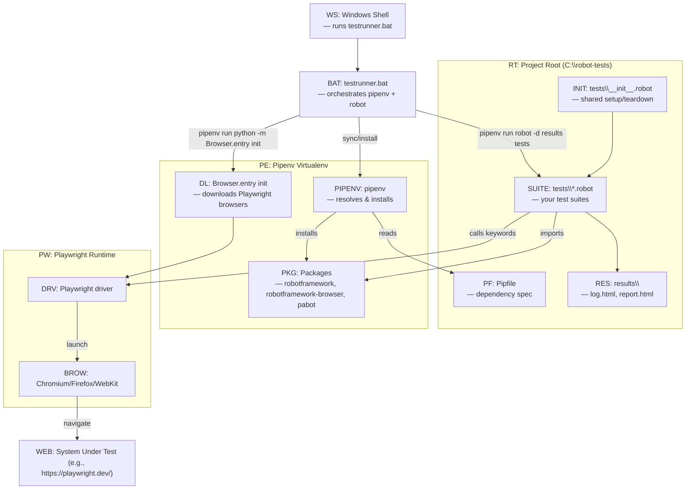
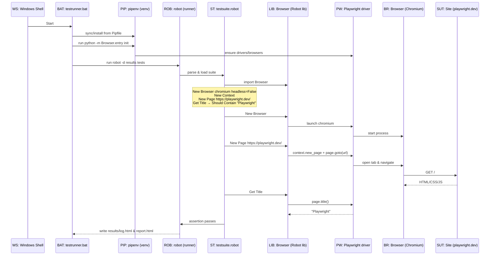

# Robot Framework — Desk Reference (Diagrams + Legends)

Use this one-pager while working with Robot Framework + Browser (Playwright). It contains three visuals:
1) Flow of references in a single `testsuite.robot`
2) Architecture / dependencies (repo & tools)
3) Runtime communication for “My First Test”

> Tip: Most editors (VS Code) can render Mermaid or export this Markdown to PDF for printing.

---

## 1) Flow of references (your `testsuite.robot`)


---

## 2) Architecture / dependencies (your repo & tools)


---

## 3) Runtime communication (your “My First Test”)


---

## Legends (abbreviations used above)

### General
- **WS** — Windows Shell (PowerShell/CMD)
- **BAT** — `testrunner.bat` (your batch runner)
- **PIP** / **PIPENV** — pipenv virtual environment/command
- **PF** — Pipfile (dependency spec)
- **PKG** — Installed packages (e.g., `robotframework`, `robotframework-browser`)
- **DL** — `Browser.entry init` step (downloads Playwright browsers)
- **PW** — Playwright driver (core engine used by Browser library)
- **BR / BROW** — Actual browser process (Chromium/Firefox/WebKit)
- **WEB / SUT** — System Under Test (your application/website)
- **RES** — results directory (`log.html`, `report.html`)

### Suite internals
- **A** — (not used as a node ID here) *Test Suite file as a whole*
- **ST** — `*** Settings ***` section (imports & configuration) **/ or** `testsuite.robot` in sequence diagram context label
- **SV** — `*** Variables ***` section
- **SK** — `*** Keywords ***` section (your custom keywords)
- **SC** — `*** Test Cases ***` section (your tests)
- **L** — Libraries (e.g., `Browser`)
- **R** — Resource files (`.robot` / `.resource` providing keywords/vars)
- **RK** — Keywords from resource files
- **RV** — Variables from resource files
- **VF** — Variable files (`.py`/`.yaml`/`.robot` providing data)
- **LK** — Keywords provided by libraries (e.g., `New Page`, `Get Title`)
- **INIT** — `__init__.robot` (directory-level suite config)

---

## Minimal working snippets (reference)

**tests\\__init__.robot**
```robot
*** Settings ***
Library         Browser
Suite Setup     New Browser    chromium    headless=${FALSE}
Suite Teardown  Close Browser
Test Setup      New Context    viewport={"width":1280, "height":800}
```

**tests\\testsuite.robot**
```robot
*** Settings ***
Library    Browser

*** Test Cases ***
My First Test
    New Page    https://playwright.dev/
    ${title}=   Get Title
    Should Contain    ${title}    Playwright
```
